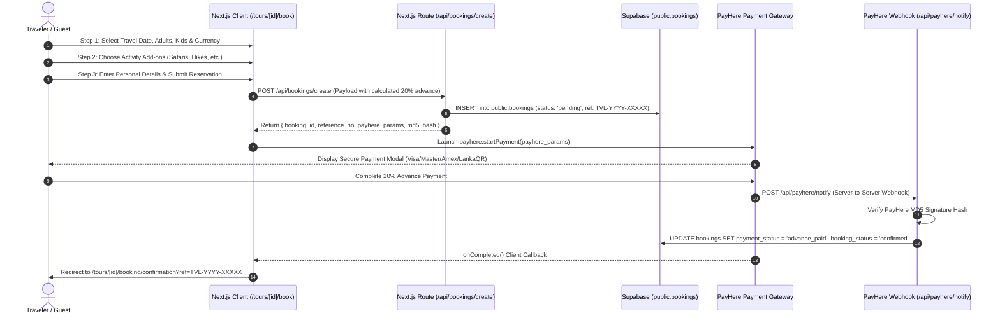

# Client-Facing Multi-Step Booking & PayHere Architecture Plan
**TripVibe Lanka Travel & Tourism Platform**
*Specification Document for Future Client-Side Implementation*

---

## 1. Executive Summary & Workflow Overview

This document outlines the architecture and execution blueprint for the public-facing 3-step booking flow and PayHere payment gateway integration for TripVibe Lanka.

### Booking Flow Architecture


---

## 2. Public Customer Workflow (3-Step Modal/Wizard)

Route: `/tours/[id]/book` (or dynamic slide-in modal on `/tours/[id]`)

### Step 1: Schedule & Travelers
* **Travel Date**: Modern date picker. Minimum date is tomorrow (`new Date() + 1 day`). Blocks past dates.
* **Adults Stepper**: Numeric input (Minimum 1, default 2).
* **Children Stepper**: Numeric input (Minimum 0, default 0). Children age 0–11 qualify for child discount or activity rates.
* **Currency Selector**: Toggle between `USD ($)` and `LKR (Rs.)`.
  * Dual pricing is pulled from `tours.price_usd` and `tours.price_lkr`.
  * Dynamic calculation reflects base tour total in real-time.

### Step 2: Experience Add-on Customizer
* Fetches active activities from `public.activities` where `destination_id = tour.destination_id` (or globally featured experiences).
* Displays visual cards with:
  * Activity title, cover thumbnail, duration (e.g., "3 Hours", "Half Day").
  * Price per person in selected currency (`USD` or `LKR`).
  * Checkbox toggle to add to trip.
  * Traveler quantity selector (defaults to adults count, customizable).
* **Live Calculation Banner**:
  * Displays base tour price + itemized add-on subtotals.
  * Live update of:
    * Total Package Value
    * 20% Online Advance Due Today
    * 80% Remaining Balance Payable on Arrival to Driver.

### Step 3: Customer Details & Checkout Review
* **Form Inputs**:
  * **Full Legal Name**: Matching passport or national identity document.
  * **Email Address**: For confirmation voucher, itinerary PDF, and PayHere receipt.
  * **WhatsApp Phone Number**: International dial-code selector + phone number (crucial for local Sri Lankan drivers).
  * **Country of Residence**: Autocomplete or select dropdown.
  * **Pickup Location**: Airport flight details (e.g., "CMB Flight UL-504 arriving 08:30 AM") or Colombo/Negombo hotel address.
  * **Special Requests / Dietary**: Textarea for vegetarian, child booster seat, twin bedding, etc.
* **Financial Summary & Payment Breakdown**:
  * Itemized review of Tour + Add-ons.
  * Explicit breakdown of:
    * Total Amount
    * 20% Advance Payable Now
    * 80% Balance Due in Cash or Card upon Arrival.
* **PayHere Checkout Action**:
  * "Proceed to Secure Payment (20% Advance)" button.
  * Test Simulation fallback if PayHere API keys are not present in `.env.local`.

---

## 3. Financial Calculation Formulas

```typescript
// 1. Base Tour Cost
const baseTourCost = (tour.price * numberOfAdults) + (tour.price * numberOfChildren * 0.5);

// 2. Add-ons Total
const addonsTotal = selectedActivities.reduce((sum, item) => {
  return sum + (item.price_per_person * item.quantity);
}, 0);

// 3. Gross Total Amount
const totalAmount = Math.round((baseTourCost + addonsTotal) * 100) / 100;

// 4. 20% Online Advance Deposit
const advancePercentage = 20.00;
const advanceAmount = Math.round((totalAmount * (advancePercentage / 100)) * 100) / 100;

// 5. 80% Remaining Balance Payable on Arrival
const remainingBalance = Math.round((totalAmount - advanceAmount) * 100) / 100;
```

---

## 4. PayHere Payment Gateway Integration Architecture

### Environment Variables
Configure in `.env.local`:
```env
PAYHERE_MERCHANT_ID="1234567"
PAYHERE_SECRET="your_payhere_merchant_secret"
NEXT_PUBLIC_PAYHERE_SANDBOX="false" # Set true for testing sandbox
NEXT_PUBLIC_APP_URL="https://tripvibelanka.com"
```

### Server-Side Hash Generation
PayHere requires an MD5 checksum to prevent client-side tampering of payment amounts.

**Formula**:
$$\text{Hash} = \text{strtoupper}(\text{MD5}(\text{merchant\_id} + \text{order\_id} + \text{formatted\_amount} + \text{currency} + \text{strtoupper}(\text{MD5}(\text{merchant\_secret}))))$$

**TypeScript Implementation (`utils/payhere.ts`)**:
```typescript
import crypto from 'crypto';

export function generatePayHereHash(
  merchantId: string,
  orderId: string,
  amount: number,
  currency: string,
  merchantSecret: string
): string {
  // Amount formatted to two decimal places, e.g., "150.00"
  const formattedAmount = Number(amount).toLocaleString('en-US', {
    minimumFractionDigits: 2,
    maximumFractionDigits: 2,
    useGrouping: false,
  });

  const hashedSecret = crypto
    .createHash('md5')
    .update(merchantSecret)
    .digest('hex')
    .toUpperCase();

  const sourceString = `${merchantId}${orderId}${formattedAmount}${currency}${hashedSecret}`;

  return crypto
    .createHash('md5')
    .update(sourceString)
    .digest('hex')
    .toUpperCase();
}
```

### PayHere Modal Integration
In Next.js frontend, include the PayHere JavaScript SDK:
```html
<!-- Production -->
<script type="text/javascript" src="https://www.payhere.lk/lib/payhere.js"></script>
<!-- Sandbox -->
<script type="text/javascript" src="https://sandbox.payhere.lk/lib/payhere.js"></script>
```

**Payment Trigger**:
```typescript
const paymentObject = {
  sandbox: process.env.NEXT_PUBLIC_PAYHERE_SANDBOX === 'true',
  merchant_id: merchantId,
  return_url: `${appUrl}/tours/${tourId}/booking/confirmation?ref=${referenceNo}`,
  cancel_url: `${appUrl}/tours/${tourId}/book?cancelled=true`,
  notify_url: `${appUrl}/api/payhere/notify`,
  order_id: referenceNo,
  items: tourTitle,
  amount: advanceAmount.toFixed(2),
  currency: currency,
  hash: md5Hash,
  first_name: customerFirstName,
  last_name: customerLastName,
  email: customerEmail,
  phone: customerPhone,
  address: pickupLocation || 'Colombo, Sri Lanka',
  city: 'Colombo',
  country: customerCountry || 'Sri Lanka',
};

payhere.onCompleted = function onCompleted(orderId: string) {
  window.location.href = `/tours/${tourId}/booking/confirmation?ref=${orderId}`;
};

payhere.onDismissed = function onDismissed() {
  console.log('Payment modal dismissed by user');
};

payhere.onError = function onError(error: any) {
  console.error('PayHere Error:', error);
};

payhere.startPayment(paymentObject);
```

---

## 5. Instant Payment Notification (IPN) Webhook Route

Path: `/app/api/payhere/notify/route.ts`

```typescript
import { NextRequest, NextResponse } from 'next/server';
import crypto from 'crypto';
import { createClient } from '@/utils/supabase/server';

export async function POST(req: NextRequest) {
  try {
    const formData = await req.formData();
    
    const merchant_id = formData.get('merchant_id') as string;
    const order_id = formData.get('order_id') as string; // reference_no
    const payhere_amount = formData.get('payhere_amount') as string;
    const payhere_currency = formData.get('payhere_currency') as string;
    const status_code = formData.get('status_code') as string;
    const md5sig = formData.get('md5sig') as string;
    const payment_id = formData.get('payment_id') as string;
    const method = formData.get('method') as string;

    const merchant_secret = process.env.PAYHERE_SECRET;
    if (!merchant_secret) {
      return NextResponse.json({ error: 'Server misconfiguration' }, { status: 500 });
    }

    // Verify MD5 Signature
    const hashedSecret = crypto
      .createHash('md5')
      .update(merchant_secret)
      .digest('hex')
      .toUpperCase();

    const expectedHash = crypto
      .createHash('md5')
      .update(`${merchant_id}${order_id}${payhere_amount}${payhere_currency}${status_code}${hashedSecret}`)
      .digest('hex')
      .toUpperCase();

    if (md5sig !== expectedHash) {
      console.error('PayHere signature verification failed');
      return NextResponse.json({ error: 'Invalid signature' }, { status: 400 });
    }

    const supabase = await createClient();

    // status_code "2" = SUCCESS
    if (status_code === '2') {
      const { error } = await supabase
        .from('bookings')
        .update({
          payment_status: 'advance_paid',
          booking_status: 'confirmed',
          payhere_payment_id: payment_id,
          payment_method: method || 'PAYHERE',
          updated_at: new Date().toISOString(),
        })
        .eq('reference_no', order_id);

      if (error) {
        console.error('Failed to update booking on IPN:', error);
        return NextResponse.json({ error: 'Database update failed' }, { status: 500 });
      }

      return NextResponse.json({ success: true, message: 'Payment confirmed' });
    }

    // status_code "-2" = FAILED, "-1" = CANCELLED
    if (status_code === '-2' || status_code === '-1') {
      await supabase
        .from('bookings')
        .update({
          payment_status: 'failed',
          updated_at: new Date().toISOString(),
        })
        .eq('reference_no', order_id);
    }

    return NextResponse.json({ status: 'Processed' });
  } catch (error: any) {
    console.error('PayHere notify handler error:', error);
    return NextResponse.json({ error: error.message }, { status: 500 });
  }
}
```

---

## 6. Confirmation Voucher View

Route: `/tours/[id]/booking/confirmation?ref=TVL-YYYY-XXXXX`

* Queries `public.bookings` joined with `tours(title, cover_image, duration_days, duration_nights)` using the reference code.
* Displays:
  * **Success Hero**: Animated checkmark, reference code with quick copy button.
  * **Voucher Card**:
    * Traveler name and contact details.
    * Dates, duration, and departure schedule.
    * Itemized list of selected experience add-ons.
    * Financial Receipt: Total cost, 20% advance received via PayHere, and remaining 80% balance due to driver.
  * **Driver Coordination Notice**: "Your assigned private chauffeur/guide details will be communicated via WhatsApp 24 hours prior to departure."
  * **Action Buttons**: "Download PDF Voucher" and "Print Itinerary".

---

## 7. Zero-Key Testing / Sandbox Graceful Fallback

When `PAYHERE_MERCHANT_ID` or `PAYHERE_SECRET` are not detected in the environment:
1. The frontend displays a clean alert banner: `"Dev / Simulator Mode Active"`.
2. Clicking "Complete Advance Payment" simulates an instant successful 20% advance payment.
3. Records are written directly to Supabase with `payment_method = 'TEST_SIMULATION'` and `payment_status = 'advance_paid'`.
4. This ensures frictionless UI/UX and end-to-end operational testing without blocking development.
